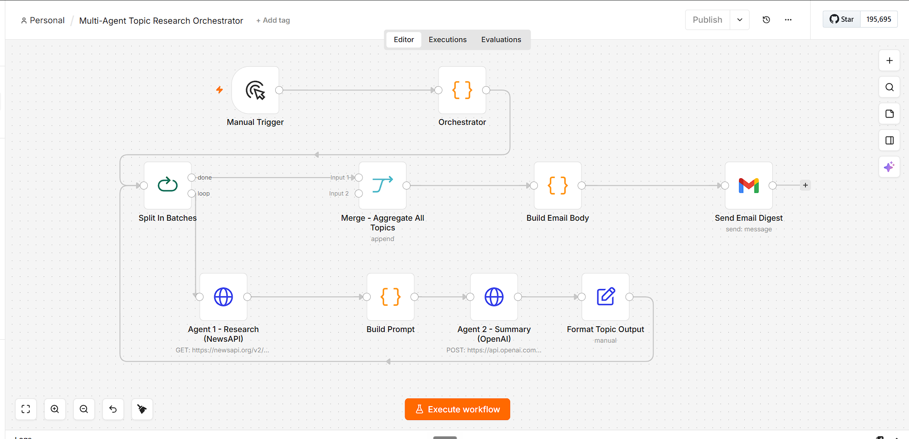

# Multi-Agent Topic Research Orchestrator (n8n)

An [n8n](https://n8n.io) workflow that runs a **two-agent research pipeline** across
a list of topics and delivers the results as a single formatted HTML email digest.

The exported workflow definition lives in
[`multi-agent-research-orchestrator.json`](./multi-agent-research-orchestrator.json)
and can be imported directly into any n8n instance.

## Architecture



## What it does

For each topic in a configurable list, the workflow orchestrates two cooperating agents:

1. **Agent 1 - Research (NewsAPI):** queries the [NewsAPI](https://newsapi.org)
   `/v2/everything` endpoint for the three most recent English-language articles on
   the topic (sorted by publish date).
2. **Agent 2 - Summary (OpenAI):** takes those headlines, builds a prompt, and calls
   OpenAI's Chat Completions API (`gpt-4o-mini`) to condense them into a concise
   two-sentence plain-English summary of what is happening in that topic area right now.

The per-topic results (topic, raw headlines, and generated summary) are aggregated and
rendered into a styled HTML **"Daily News Digest"** email that is sent via Gmail.

### Pipeline flow

```
Manual Trigger
   └─ Orchestrator (defines the list of topics)
        └─ Split In Batches ──────────────┐  (loops once per topic)
             ├─ Agent 1 - Research (NewsAPI)
             │      └─ Build Prompt
             │           └─ Agent 2 - Summary (OpenAI)
             │                └─ Format Topic Output ─┘ (back into the loop)
             └─ Merge - Aggregate All Topics
                  └─ Build Email Body (HTML digest)
                       └─ Send Email Digest (Gmail)
```

The **Orchestrator** node seeds the topic list (e.g. *NZ job market*, *NZ politics and
elections*, *London fintechs*, *AI automation*). The **Split In Batches** node drives the
loop: each topic is passed through the research → summary sub-pipeline, its output is
formatted, and control returns to the loop until every topic is processed. Once the batch
loop completes, all topic results are merged and composed into one email.

## What it demonstrates

- **Multi-agent orchestration** - two distinct, single-responsibility agents (a research
  agent and a summarisation agent) chained so the output of one becomes the input of the next.
- **Batch processing** - a Split-In-Batches loop that applies the same pipeline
  independently to each item in a topic list and re-aggregates the results.
- **API integration** - HTTP Request nodes integrating two external REST APIs (NewsAPI
  and OpenAI) plus Gmail for delivery.
- **Structured data transformation** - Code and Set nodes that shape API responses,
  build prompts, normalise fields, and render aggregated data into a formatted HTML digest.

## Credentials & security

**No API keys are hardcoded in this workflow.** Both HTTP Request nodes authenticate via
n8n's built-in **credential store** (referenced by credential ID), using generic
credential types:

- **Agent 2 - Summary (OpenAI):** `httpHeaderAuth` credential supplying the
  `Authorization: Bearer …` header.
- **Agent 1 - Research (NewsAPI):** `httpQueryAuth` credential supplying the `apiKey`
  query parameter.

To run this workflow in your own n8n instance, create those two credentials and attach
them to the respective nodes. Keeping secrets in the credential store (rather than inline
in the node parameters) keeps them out of the exported JSON and out of version control.
